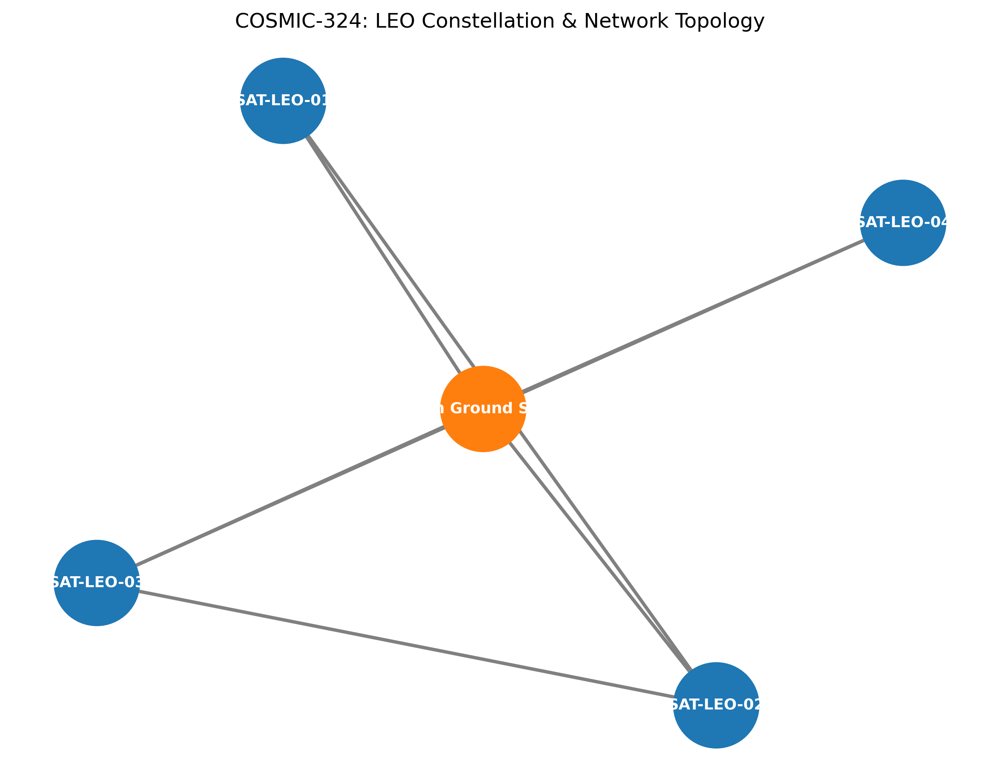

# COSMIC-324: LEO Satellite Constellation Simulation Framework

> A lightweight, efficient software framework for simulating and analyzing Low Earth Orbit (LEO) satellite constellations and routing data across space.

---

## 📌 Overview
**COSMIC-324** is an advanced MVP (Minimum Viable Product) designed specifically to help researchers, graduate students, and engineering labs simulate LEO satellite networks and routing trajectories quickly and cost-effectively, bypassing the extreme complexity and high costs of legacy proprietary software (such as STK and MATLAB).

## 👥 The Team
- **Dr. Yusif Zakria Eissa Arbab** - Co-Founder (Strategic Management, Legal & Regulatory Affairs).
- **Ali Zaid Al-Sheri** - Co-Founder (Systems Engineering, Technical Development & Documentation).

---

## ⚙️ Core Modules
The framework is built on a clean, modular Python architecture:
1. **Orbital Dynamics Module (`orbital_dynamics.py`):** Calculates 3D satellite positions and real-time spatial distances with high precision.
2. **Routing & Network Engine (`app.py`):** Uses `NetworkX` to model constellation topology and apply speed-of-light shortest-path routing algorithms.
3. **Interactive Workspace (`cosmic_simulation_demo.ipynb`):** A Jupyter notebook allowing step-by-step simulation execution and live result visualization.
4. **Visualization Layer (`Matplotlib`):** Generates graphs tracking latency evolution and handover events over time.

---

## 🚀 Installation & Quick Start

1. **Clone the Repository:**
   ```bash
   git clone [https://github.com/YOUR_USERNAME/COSMIC-324-LEO-Simulator.git](https://github.com/YOUR_USERNAME/COSMIC-324-LEO-Simulator.git)
   cd COSMIC-324-LEO-Simulator

### Simulation Results & Architecture

Here are the visual outputs generated by the COSMIC-324 simulation engine:

**1. LEO Satellite Latency Evolution:**


**2. Constellation & Network Topology Map:**

# COSMIC-324: LEO Satellite Constellation Simulation Framework
A modular open-source software framework for LEO satellite network simulation and routing analysis.

## Overview
**COSMIC-324** is an open-source MVP (Minimum Viable Product) simulation framework designed specifically to assist researchers, graduate students, and engineering labs in simulating Low Earth Orbit (LEO) satellite constellations and executing efficient space-based data routing. It aims to provide a flexible, accessible alternative to expensive, proprietary commercial software (such as STK and MATLAB), facilitating rapid prototyping, academic research, and education in early-stage developments.

## The Team
* **Dr. Yousif Zakaria Issa Arbab**  
  *Strategic Management, Legal Architecture, Research Direction*
* **Ali Zaid Al-Shahri**  
  *Software Engineering, Python Development, System Architecture*

## Core Modules
The framework is built on a clean, modular Python architecture:
1. **Orbital Dynamics Module (`orbital_dynamics.py`):** Calculates 3D satellite positions and real-time spatial distances with high fidelity.
2. **Routing & Network Engine (`app.py`):** Models constellation topology and applies speed-of-light shortest-path routing algorithms.
3. **Interactive Workspace (`cosmic_simulation_demo.ipynb`):** Allows step-by-step simulation execution and interactive visual inspection.
4. **Visualization Layer (`Matplotlib`):** Generates analytical graphs tracking latency evolution, propagation delays, and handover events.

## Installation & Quick Start

1. **Clone the Repository:**
   ```bash
   git clone [https://github.com/yousifarbab/COSMIC-324-LEO-Simulator.git](https://github.com/yousifarbab/COSMIC-324-LEO-Simulator.git)
   cd COSMIC-324-LEO-Simulator
